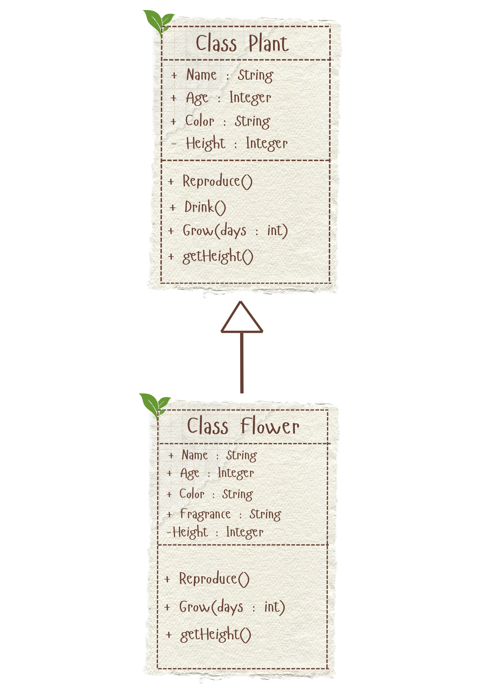
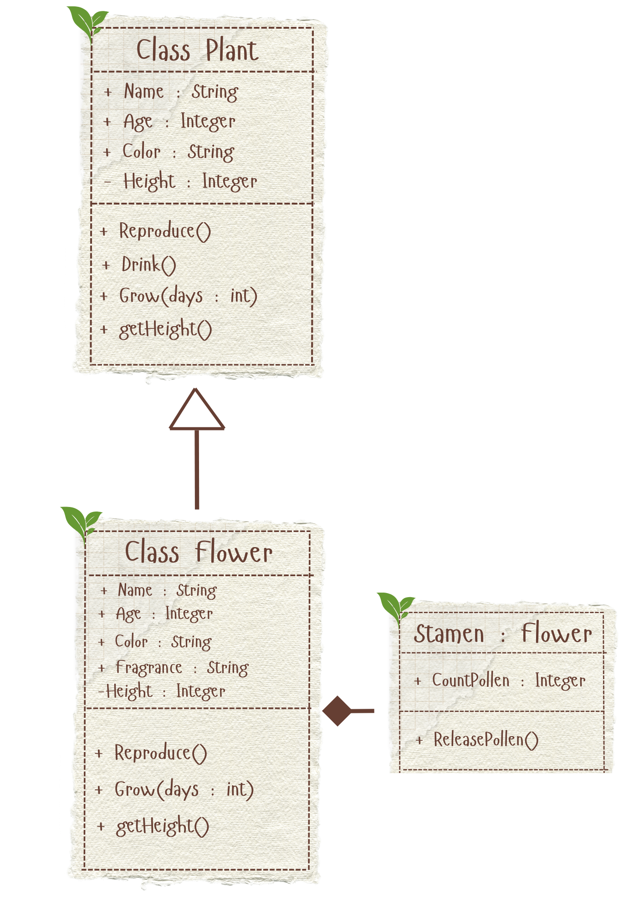
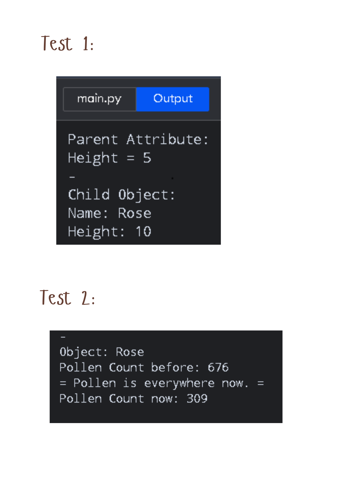
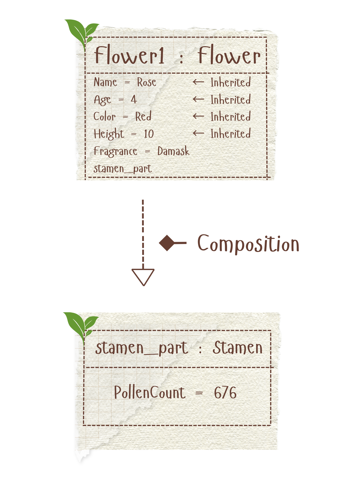

# Advanced Class Relationships
## Previous Activities
[classAttrib](classAttributesMethods.md)
[classRel](classRelationships.md)
## Existing System Description
1. What classes currently exist in your system?
Class 1: Plant Class 2: Insect
2. What problem or limitation exists in your current design?
Explain: The classes are too large and general. For example, plants could be a tree, have a flower, or be a shrub.
## Inheritance Relationship
Parent: Plant
Child: Flower
Explanation: Some plants are genotypes, which means the plant has flowers.
## Inheritance UML

## Composition/Aggregation
Relationship: Composition
Class containing another object: Flower
Contained object: Stamen
Explanation: A flower needs its stamen in order to reproduce.
## Advanced UML Diagram

## Python Implementation
[Source Code](advancedRelationships.py)
## Test Run

## Object Diagram

## Reflection
Answers:
