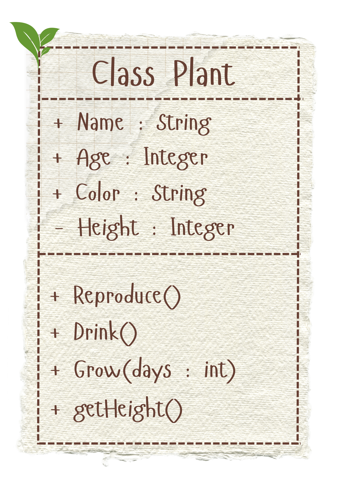
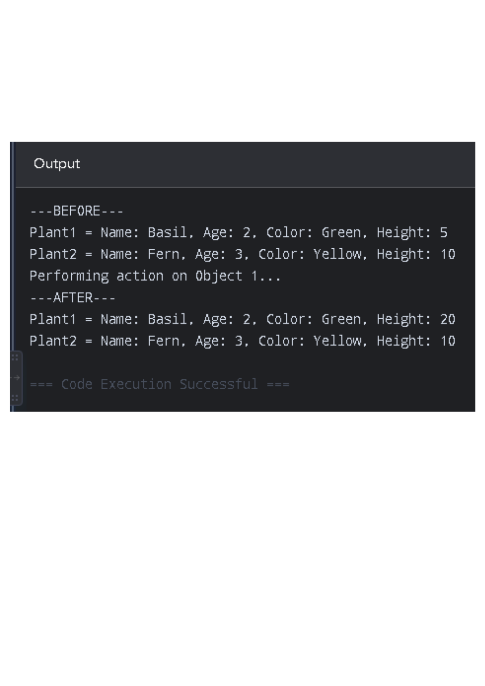

# Class Attributes and Methods

## Previous Design
Link to my previous activity:
[classObjectUML.md](classObjectUML.md)

## Design Revision
No major changes were needed from my original design.

## Visibility Decisions
| Attribute | Data Type | Visibility | Why Public/Private? |
|---|---|---|---|
| Name | String | Public | Puts a label and makes it more easier to read/change directly. |
| Age | Integer | Public | Can easily track the lifespan of the plant. |
| Color | String | Public | Can easily track the condition of the plant. |
| Height | Integer | Private | Protects and prevents accidental change like a negative height. |

## Updated UML Class Diagram

## Python Implementation
[View Python Source](classImplementation.py)

## Test Run

## Object Diagram

## Analysis
### Why did you make your chosen attribute private?
- I made my chosen attribute private (height) private so that it prevents me or anyone from changing the height to values that are not possible like negative.
  
### Which method changes the state of your object?
- The method that changes the state of my object is Grow because it changes the height of the plant.
  
### How did your two objects demonstrate that instances are independent?
- While the plant1's height changed due to the action performed on it,  plant2's height remained the same in the after part of the output.

### What is the difference between your class diagram and your object diagram?
- 
