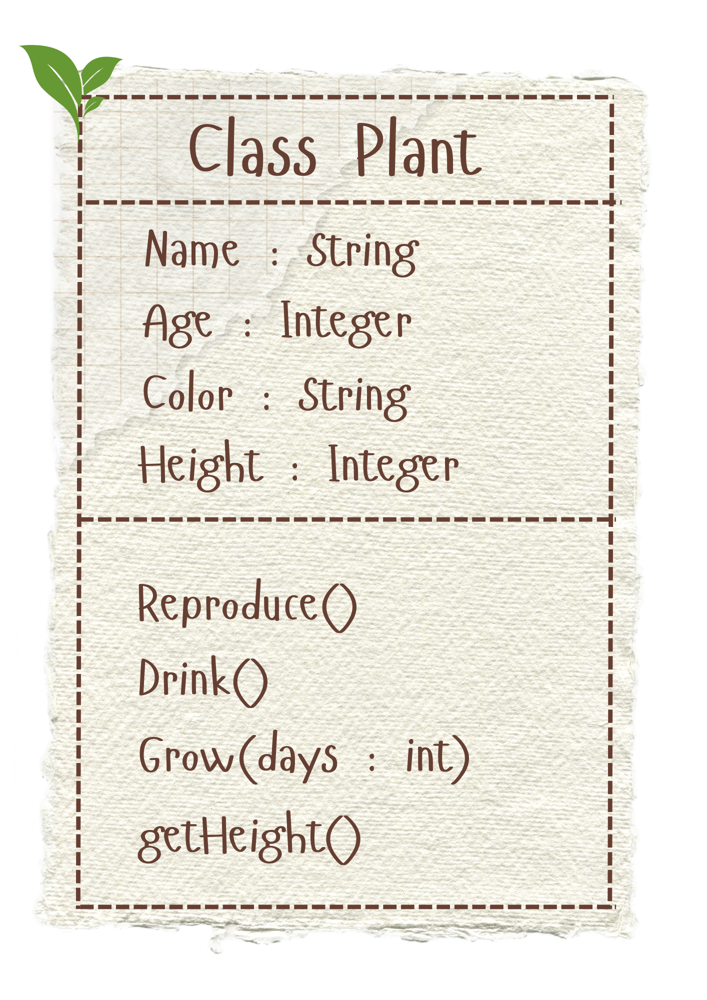

# SG4 - Understanding Classes and Objects
## Class Name: Plant
## Class Description: The class contains different kinds of plants, their description and behaviour.
## Properties
| Property | Data Type | Description |
|---|---|---|
| Name | String | The name of the plant. |
| Age | Integer | The age of the plant. |
| Color | String | The color of the plant like green, yellow or red. |
| Height | Integer | The height or how tall the plant is. |
## Methods
| Method | Description |
|---|---|
| Reproduce() | The plant is able to reproduce sexually or asexually through flowers, fruits, etc. |
| Drink() | The plant drinks or soaks up when water is present or given. |
| Grow(days : int) | The plant grows and increases in height. |

## Class Diagram

## Design Explanation
### Why did you choose this class?
- I chose this class because I really like plants and taking care of them. They are really cool and I'm especially interested about their uses.
### Which property is the most important? Why?
- The most important property is Color, because it is able to indicate the plant's condition and health. Ex. When the color of the leaves is brown.
### Which method is the most useful? Why?
- The most useful method is Drink because plants need to drink in order to live and become healthy.

## Design Revision
- No major changes were needed from my original design.

## Public/Private
| Attribute | Data Type | Visibility | Why Public/Private? |
|---|---|---|---|
| Name | String | Public | Puts a label and makes it more easier to read/change directly. |
| Age | Integer | Public | Can easily track the lifespan of the plant. |
| Color | String | Private | Protects the condition of the plant. |
| Height | Integer | Private | Protects and prevents accidental change like a negative height. |

