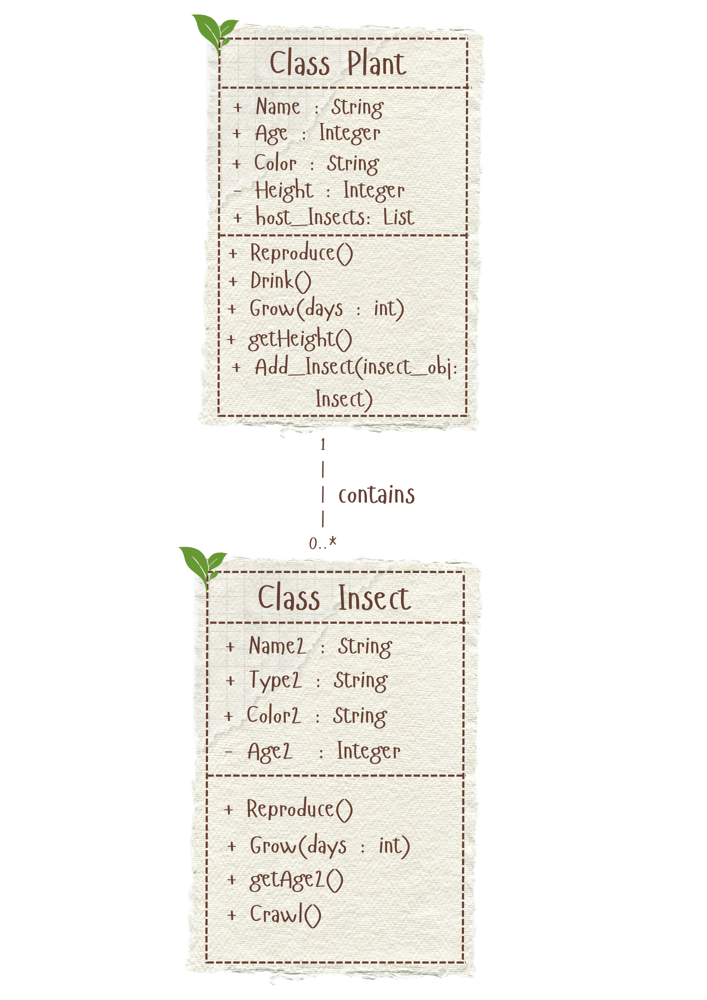
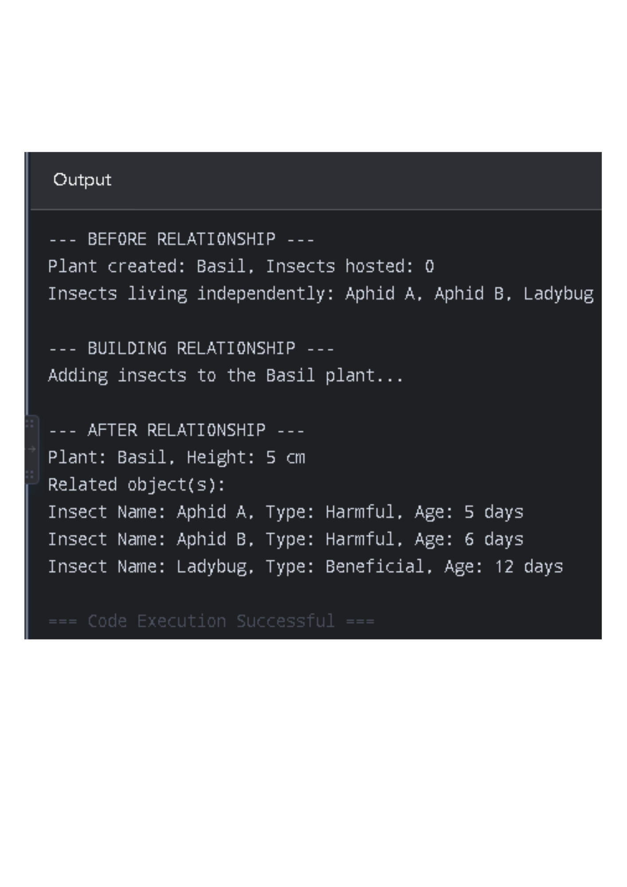
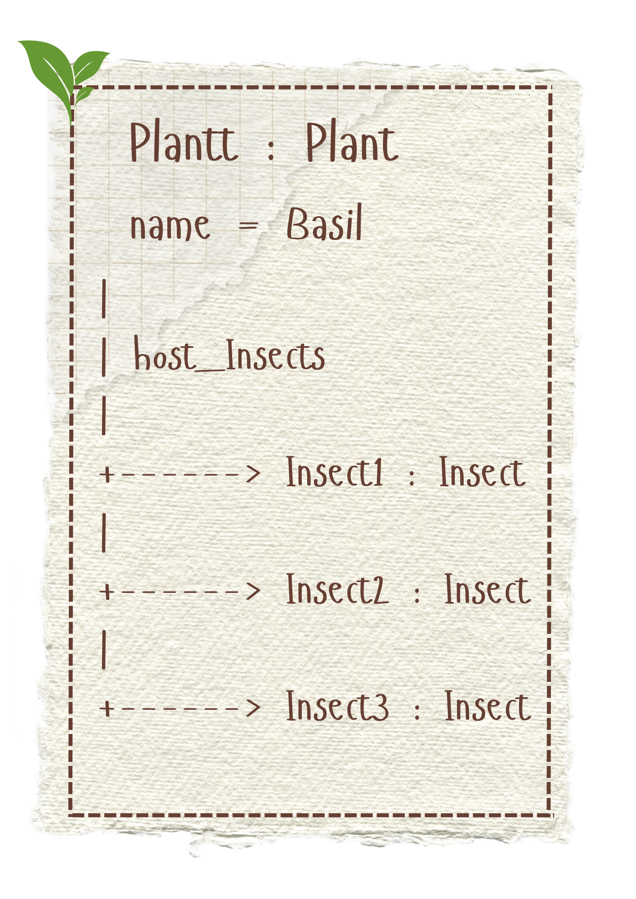

# Class Relationships: Association and Multiplicity
## Previous Work
[Part I - Classes and Objects](classObjectUML.md)
[Part II - Class Attributes and Methods](classAttributesMethods.md)
## Existing Class
Class: Plant
Description: The class contains different kinds of plants, their description and behaviour.
## New Related Class
Class: Insect
Description: The class contains different kinds of insects, their description and behavior.
## Association
Relationship: Plant HAS Insects
Explanation: There can be one to many insects in a plant that is beneficial, neutral or harmful.
## Multiplicity

Multiplicity: 1..*
Explanation: A plant could have an insects, few, or many depending on its condition and what type.
## UML Class Relationship Diagram

## Python Implementation
[View Python Source](classRelationships.py)
## Test Run

## Object Relationship Diagram

## Analysis
### What is the association between your two classes?
- Plant class acts as a host for insect class to live in and serve as a living habitat. For example, basil (the plant) hosts 3 insects (2 aphids and a ladybug). This two classes cooperate and interact with each other as two distinct life forms.
### What multiplicity did you choose and why?
- The multiplicity I chose was "1..*". This is because a plant can realistically have at least 1 insect, or usually, many different kinds. Any other multiplicity wouldn't make sense because a plant can store many insects in its living habitat.
### How did you implement the relationship in Python?
- I implemented this relationship in Python by creating an empty list attribute. The attribute that stores these items is called self.host_Insects inside the Plant class. So for every time we call the Add_Insect(), the program takes an insect object and puts it into the list.
### Why did you store an object reference instead of copying its data?
- I stored an object reference instead of copying its data because storing a reference means the plant connects to the actual insect instead of creating a copy. For example, if Insect1 uses Grow() so that its age would change, the plant sees the new age right away. If we just copied the data, the plant's data would get stuck with the same old information.
### If your relationship uses many, why is a list appropriate?
- A Python list is appropriate when the relationship is many because it lets us easily add as much insects as we want any time without breaking it. The list actually holds the actual insects that is living in the plant. Additionally, because the actual insects are inside the list, we can just use a loop to easily pull out these bug's name and age whenever we want.
